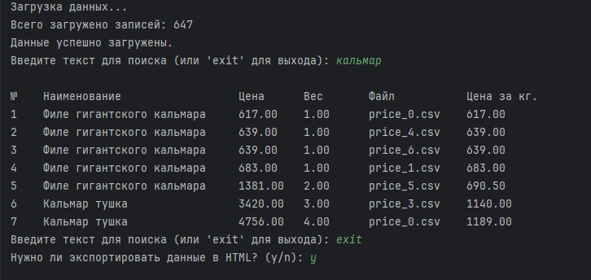
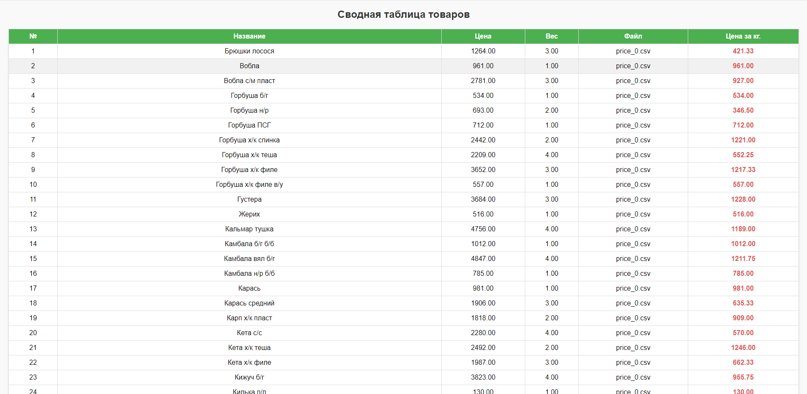

# Price_analyzer

**Price_analyzer** — это Python-приложение для загрузки, обработки и поиска ценовых данных из CSV-файлов. Программа позволяет находить товары по заданному тексту и экспортировать результаты в HTML-формате.

## Возможности

- Автоматическая загрузка данных из CSV-файлов, содержащих "price" в имени, из указанной папки.
- Вычисление цены за килограмм для каждого товара.
- Поиск товаров по заданному тексту.
- Экспорт найденных товаров в HTML-формате с автоматическим открытием результата в браузере.

## Установка

1. Убедитесь, что у вас установлен Python версии 3.6 или выше.
2. Склонируйте репозиторий или скачайте файлы проекта:
   ```bash
   git clone https://github.com/nuggetpluto/Price_analyzer.git
   ```
3. Установите необходимые зависимости:
   ```bash
   pip install -r requirements.txt
   ```

## Использование

1. Запустите приложение:
   ```bash
   python project.py
   ```
2. Программа предложит ввести текст для поиска товаров.
3. Если товары найдены, программа предложит экспортировать данные в HTML. Введите `да` для подтверждения.
4. После успешного экспорта результат автоматически сохранится в файле output.html.

## Пример работы

### 1. Поиск товара в терминале
Программа позволяет искать товары по ключевым словам. Вот пример поиска товаров, содержащих слово "кальмар":



### 2. Результат экспорта в HTML
После подтверждения экспорта программа создаёт HTML-файл с результатами, который автоматически открывается в браузере:




## Лицензия

Этот проект распространяется под лицензией MIT. Подробности см. в файле [LICENSE](LICENSE).
